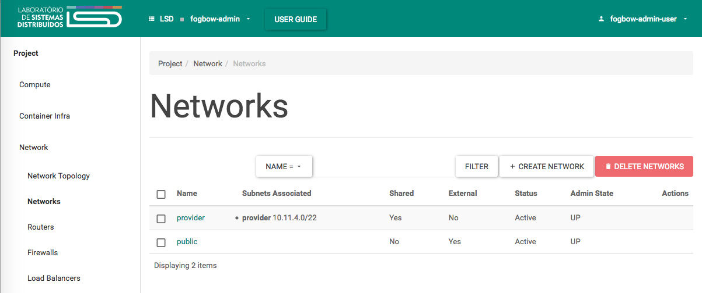
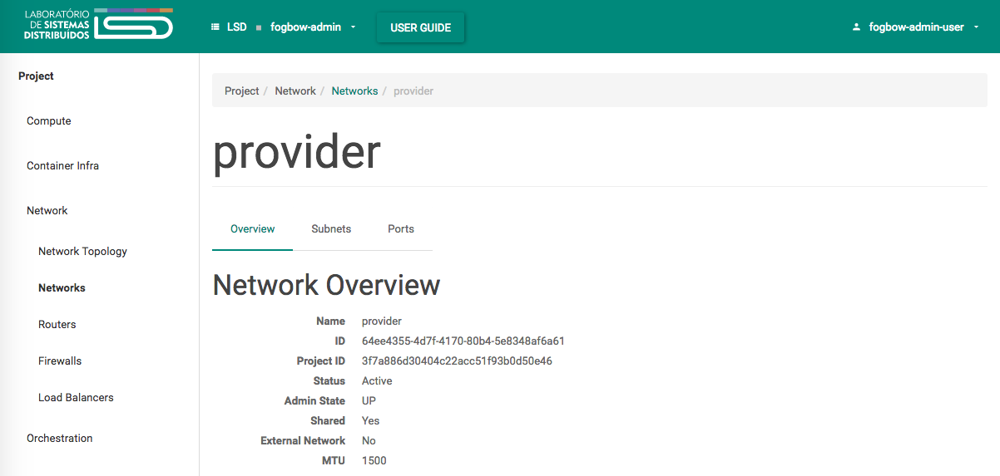
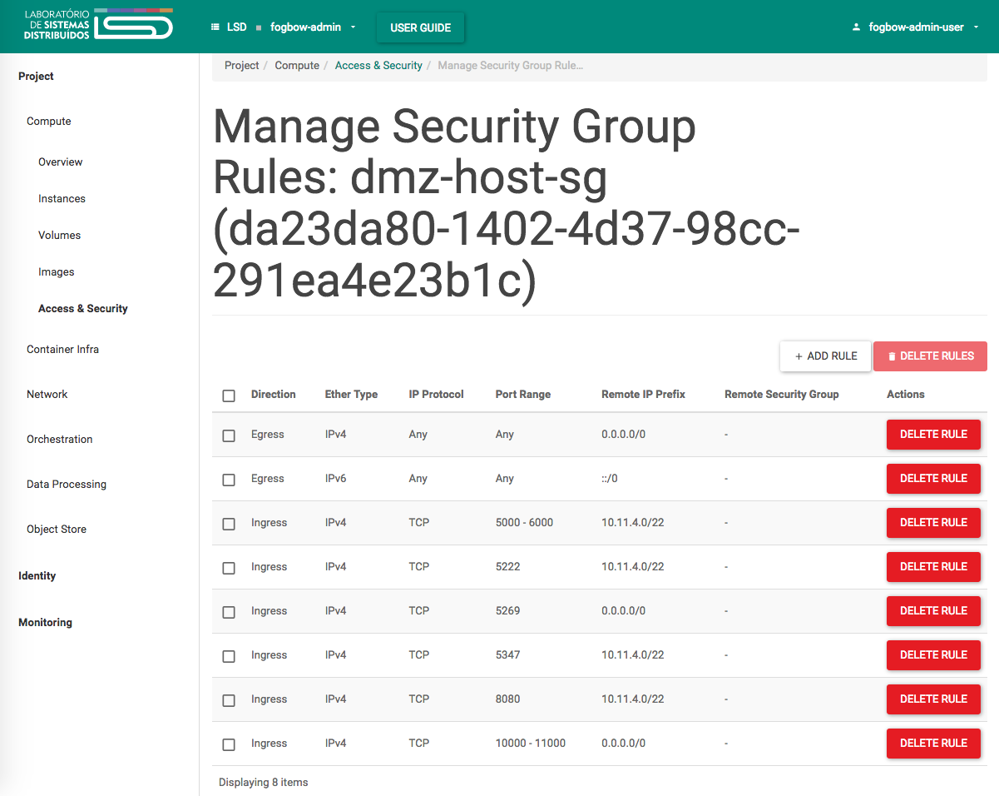
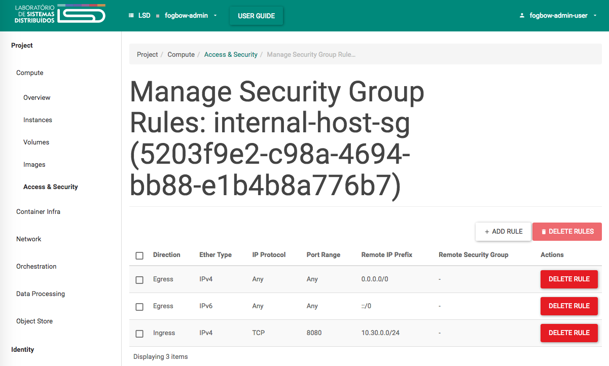

Title: Install Fogbow Infrastructure
url: install-fogbow-infra
save_as: install-fogbow-infra.html
section: install
index: 1

# Installing a Fogbow site running OpenStack

This tutorial provides an easy way to deploy a Fogbow site on an OpenStack cloud, 
using the organization's LDAP service for the authentication of the federation users belonging
to the site.

## Pre-installation

Before installing Fogbow, it is necessary to setup a few things in the OpenStack cloud that is going to be 
federated. More precisely, it is necessary to ask the cloud administrator to create two projects, 
associate at least one user with each project, and define suitable resource usage quotas for each project. 

The first project is going to be used to deploy the Fogbow services, while the second one
defines the cloud resources that will be made available to the federation, through Fogbow. Let us assume that the
first project is called **fogbow-admin**, and the second **fogbow-resources**. Your user ID in the cloud needs
to be associated with the **fogbow-admin** project. For the **fogbow-resources** project, a new user needs to
be created, and associated with this project. Let us assume that this user is called **fogbow-resources-user**,
and that its password is **userpasswd**.

The resource quota for the **fogbow-management** project should allow the creation of at least two instances, 
one of them with a public IP, or with the ability to be assigned a floating public IP. It should also allow the
creation of at least two Security Groups. On the other hand, the resource quota for the **fogbow-resources**
project defines the maximum number of virtual machines, volumes,
floating IPs, Security Groups (which define the maximum number of private networks that can be created by Fogbow),
as well as the maximum amount of RAM and storage that the cloud will provide to federation users, through Fogbow.

Also, there must be a shared network in the cloud that allows virtual machines connected to it to access hosts
outside the cloud, and possibly have floating IPs assigned to them. This will allow these VMs to be reached from
outside the cloud and the organization's private network. Let us call this network the **provider** network.

Take the opportunity that you are talking to the cloud administrator to note down some important information
that you will need when configuring the system. The list below summarizes the required information:

* The endpoint of the Nova service (Compute) - let us assume that it is **https://mycloud.mydomain:8774**;
* The endpoint of the Neutron service (Network) - let us assume that it is **https://mycloud.mydomain:9696**;
* The endpoint of the Cinder service (Block Storage) - let us assume that it is **https://mycloud.mydomain:8776**;
* The endpoint of the Glance service (Image) - let us assume that it is **https://mycloud.mydomain:9292**;
* The endpoint of the Keystone service (Identity) - let us assume that it is **https://mycloud.mydomain:5000/v3**;
* The ID of the **fogbow-resources-user** - let us assume that it is **21868d4dd0ff4257a1ae31ece604810d**;
* The ID of the **fogbow-resources** project - let us assume that it is **82a2934cef4c4eab9dc9d30e53401beb**.

### Create the infrastructure

A typical deployment of a Fogbow site involves the installation of several services. The **messaging-service** and the
**fogbow-reverse-tunnel-service** are deployed outside the private network of the organization, ie. in a DMZ. Let us
call this machine the **dmz-host**. The **dmz-host** must have a public IP.
 
All remaining services can be deployed in hosts inside the private network. Let
us assume a single host, and call it **internal-host**. The following services will be deployed in this host:
**fogbow-resource-allocation-service**, **fogbow-membership-service**, **fogbow-federated-network-service**,
and the **fogbow-gui**. We assume that the **fogbow-gui**, which provides a graphical user interface to Fogbow
users, will be used only from inside the organization's private network. Let us assume that the CIDR of the
organization's private network is **10.30.0.0/24**. Users needing to use the **fogbow-gui** from outside the
organization will first need to setup a VPN, and then access the service. 

Thus, the first step in the deployment of a Fogbow site is to create the virtual machines where the above mentioned
services will be deployed. However, before creating these virtual machines, it is necessary to create appropriate
Security Groups that will be assigned to them.

Log in in the cloud dashboard (Horizon) using the credentials of the **fogbow-admin-user**, and
select the **fogbow-admin-project**. 

Firstly, access the "Project/Networks/Network" menu (see Figure below).



You should see at least the **provider** network displayed. You need to take note of its CIDR (**10.11.4.0/22**
in the example shown in the Figure). You will also need the OpenStack ID of this network, which can be seen by
clicking on the network name, and then on the "Overview" tab (see Figure below; in this example the ID is
**64ee4355-4d7f-4170-80b4-5e8348af6a61**).



Then, access the "Project/Compute/Access & Security" menu, and create two new Security Groups, one for the
**dmz-host**, and another for the **internal-host**. You do that by clicking on the "+ CREATE SECURITY GROUP"
button, and using the values described below.
 
 ##### Security Group for the **dmz-host**

* Name: **dmz-host-sg**
* Description: **Allows traffic to the world, and from the world to the XMPP and Reverse Tunnel ports.
Allows ssh traffic from machines in the organization's private network.**

After the security group is created, you need to add its rules. Click on the "MANAGE RULES" button, 
and then multiple times on the "+ADD RULE" button to add the following rules:

* **Custom TCP Rule, Ingress, Port, 5222, CIDR: provider CIDR (eg. 10.11.4.0/22).**
* **Custom TCP Rule, Ingress, Port, 5347, CIDR: provider CIDR (eg. 10.11.4.0/22).**
* **Custom TCP Rule, Ingress, Port, 5269, CIDR: 0.0.0.0/0.**
* **Custom TCP Rule, Ingress, Port, 8080, CIDR: provider CIDR (eg. 10.11.4.0/22).**
* **Custom TCP Rule, Ingress, Port Range, From: 5000, To: 6000, CIDR: provider CIDR (eg. 10.11.4.0/22).**
* **Custom TCP Rule, Ingress, Port Range, From: 10000, To: 11000, CIDR: 0.0.0.0/0.**
* **Custom TCP Rule, Ingress, Port, 22, CIDR: organization's private network CIDR (eg. 10.30.0.0/24).**

After that, the **dmz-host-sg** Security Group should look like what is shown in the Figure below.



Ports 5222, 5347 and 5269 are used by the **fogbow-messaging-service**, while port 8080 and the port ranges 10000-11000
and 5000-6000 are, respectively, the server port, the external port range, and the internal port range used by the
**fogbow-reverse-tunnel-service**. The values of these ports will be informed, later on, when configuring the
intsallation. Thus, if required, that may change. However, it is important to use the same ports in the Security
Groups, as well as in the configuration files. Finally, enabling ingress to port 22 from the organization's private
network allows the software to be installed in the **dmz-host** from a machine in this network.

#### Security Groups for the **internal-host**

* Name: **internal-host-sg**
* Description: **Allows traffic from the organization's private network to the **fogbow-gui** port.
Allows ssh traffic from machines in the organization's private network.**

Again, click on the "MANAGE RULES" button, and on the "+ADD RULE" button to add the following rule:

* **Custom TCP Rule, Ingress, Port, 80, CIDR: organization's private network CIDR (eg. 10.30.0.0/24).**
* **Custom TCP Rule, Ingress, Port, 22, CIDR: organization's private network CIDR (eg. 10.30.0.0/24).**

After that, the **internal-host-sg** Security Group should look like what is shown in the Figure below.



Port 80 is used to connect to **fogbow-gui**, while port 22 is used to install the necessary software
in the **internal-host**.

#### Create **dmz-host**

Now you can create the **dmz-host** VM. Go to the "Project/Compute/Instances" menu and click on the 
"LAUNCH INSTANCE" button. Follow the step-by-step procedure to select an appropriate image, and flavor.
Make sure you will include the **provider** network, and the **dmz-host-sg** Security Group. The
**dmz-host** will be created and will receive a private IP from the **provider** network. Let us
assume that this IP is **10.11.4.2**.

Then, you need to associate a floating IP to the newly created **dmz-host** VM. You can do that by
clicking on the "ASSOCIATE FLOATING IP" button that appears next to the VM in the "Project/Compute/Instances"
screen. Let us assume that this IP is **100.30.1.1**.

#### Create **internal-host**

Follow similar steps as described above to create the **internal-host** VM. Again, follow the step-by-step procedure
to select an appropriate image, and flavor. This time, make sure you will include the **provider** network, and the
**internal-host-sg** Security Group. The **internal-host** will be created an will receive a private IP from the
**provider** network. Let us assume that this IP is **10.11.4.3**.

### DNS configuration

Now that the infrastructure has been created, you need to have the DNS configured, so to enable the **dmz-host**
to receive XMPP messages. This DNS entry is the **XMPP ID** a.k.a **member-site-id** of the Fogbow installation.
This configuration associates the private IP of the **dmz-host** to its **XMPP ID**. You will need to talk to your
organization's system adminstrator and ask for the following entry to be included:

**fogbow**.**mydomain**        IN  A   **dmz-host** private IP (eg. **10.11.4.2**)

Take the opportunity that you are talking to the system administrator to note down some important information
that you will need when configuring the system. The list below summarizes the required information:

* The endpoint of the LDAP service - let us assume that it is **ldap://ldap.mydomain:389**;
* The encryption algorithm used by LDAP - let us assume that it is ****;
* ldap_base - let us assume that it is **dc=mydomain**;
* The path to the private key file - let us assume that it is ****;
* The path to the public key file - let us assume that it is ****.

## Installation

Now you are ready to install the Fogbow software. You will do that from a machine in the organization's private network 
that runs Linux and that has access to both the **dmz-host** and the **internal-host**.

### Environment setup

1. Download the *fogbow-playbook* project:

```bash
$ git clone https://github.com/fogbow/fogbow-playbook.git
```

2. Install [Ansible](https://docs.ansible.com/ansible/latest/installation_guide/intro_installation.html).

### Edit Fogbow configuration files

Go to the directory *conf-files* inside *fogbow-playbook* directory.

```bash
$ cd fogbow-playbook/conf-files
```

Then, edit the configuration files present in this directory. Please, note that it is only **necessary** to edit
the configuration constants that have an annotation "*# Required*" in the line above them.

#### Hosts configuration

File: [hosts.conf](https://github.com/fogbow/fogbow-playbook/blob/master/conf-files/hosts.conf)

The ***dmz_host_private_ip*** configuration constant is the **dmz-host** private network address.

The ***dmz_host_public_ip*** configuration constant is the **dmz-host** public network address.

The ***internal_host_private_ip*** configuration constant is the **internal-host** private network address.

The **remote_hosts_user** is the user name that should be used to access the **dmz-host** and the
**internal-host** via ssh. Ley us assume that this user name is **ubuntu**.

Considering the example values assumed in this guide, the content of the *hosts.conf* would be:

```bash
$ cat hosts.conf
# Required
dmz_host_private_ip=10.11.4.2

# Required
dmz_host_public_ip=100.30.1.1

# Required
internal_host_private_ip=10.11.4.3

# Required
remote_hosts_user=ubuntu

# Not Required (if not specified, ansible will use the host ssh keys)
ansible_ssh_private_key_file=
```

#### Behavior configuration

File: [behavior.conf](https://github.com/fogbow/fogbow-playbook/blob/master/conf-files/behavior.conf)

This file contains the configuration of the plugins that define the behavior of Fogbow's resource allocation service.
We are assuming that authentication of federation users is performed by the local LDAP service, all authentic users
are allowed to execute all operations, and that a all-to-one mapping of federation users to local users is used. Thus,
the content of the *behavior.conf* file is:

```bash
$ cat behavior.conf
# Not Required
federation_identity_plugin_class=org.fogbowcloud.manager.core.plugins.behavior.federationidentity.LdapIdentityPlugin

# Not Required
authorization_plugin_class=org.fogbowcloud.manager.core.plugins.behavior.authorization.DefaultAuthorizationPlugin

# Not Required
local_user_credentials_mapper_plugin_class=org.fogbowcloud.manager.core.plugins.behavior.mapper.DefaultLocalUserCredentialsMapper
```
#### LDAP federation identity plugin configuration

File: [ldap-identity-plugin.conf](https://github.com/fogbow/fogbow-playbook/blob/master/conf-files/behavior-plugins/federation-identity/ldap-identity-plugin.conf)

We are using the LDAP Federation Identity Plugin. To configure this plugin, you need to edit
the *ldap-identity-plugin.conf* file.

```bash
$ cat ldap-identity-plugin.conf
# Required
ldap_identity_url=ldap://ldap.mydomain:389

# Required
private_key_path=

# Required
public_key_path=

# Required
ldap_base=dc=mydomain

# Required
ldap_encrypt_type=
```

#### Default authorization plugin configuration

No configuration is required.

#### Default local user credentials mapper plugin configuration

File: [default_mapper.conf](https://github.com/fogbow/fogbow-playbook/blob/master/conf-files/behavior-plugins/local-user-credentials-mapper/default_mapper.conf)

Considering the example values assumed in this guide, the content of the *default_mapper.conf* file would be:

```bash
$ cat default_mapper.conf
# Keystone V3 Identity

# Required
local_token_credentials_projectId=82a2934cef4c4eab9dc9d30e53401beb

# Required
local_token_credentials_password=userpasswd

# Required
local_token_credentials_userId=21868d4dd0ff4257a1ae31ece604810d
```

#### Cloud configuration

File: [cloud.conf](https://github.com/fogbow/fogbow-playbook/blob/master/conf-files/cloud.conf)

Assuming that the OpenStack version installed is later than the Newton, version, then, the content of the
*cloud.conf* file is the following:

```bash
$ cat cloud.conf
# Required
local_identity_plugin_class=org.fogbowcloud.manager.core.plugins.cloud.openstack.KeystoneV3IdentityPlugin

# Cloud resources plugin classes #
# Required
compute_plugin_class=org.fogbowcloud.manager.core.plugins.cloud.openstack.OpenStackNovaV2ComputePlugin

# Required
volume_plugin_class=org.fogbowcloud.manager.core.plugins.cloud.openstack.OpenStackV2VolumePlugin

# Required
network_plugin_class=org.fogbowcloud.manager.core.plugins.cloud.openstack.OpenStackV2NetworkPlugin

# Required
attachment_plugin_class=org.fogbowcloud.manager.core.plugins.cloud.openstack.OpenStackNovaV2AttachmentPlugin

# Required
compute_quota_plugin_class=org.fogbowcloud.manager.core.plugins.cloud.openstack.OpenStackComputeQuotaPlugin

# Required
image_plugin_class=org.fogbowcloud.manager.core.plugins.cloud.openstack.OpenStackImagePlugin
```

After the *cloud.conf* has been configured, it is necessary to edit the file with specific configurations of
the OpenStack plugins. 

File: [openstack.conf](https://github.com/fogbow/fogbow-playbook/blob/master/conf-files/cloud-plugins/openstack.conf)

Considering the example values assumed in this guide, the content of the *openstack.conf* file would be:

```bash
$ cat openstack.conf
# V2 Compute #
# Required
openstack_nova_v2_url=https://mycloud.mydomain:8774

# V2 Network #
# Required
openstack_neutron_v2_url=https://mycloud.mydomain:9696

# Not Required (provider network)
default_network_id=64ee4355-4d7f-4170-80b4-5e8348af6a61

# V2 Volume #
# Required
openstack_cinder_url=https://mycloud.mydomain:8776

# V2 Image #
# Required
openstack_glance_v2_url=https://mycloud.mydomain:9292

# V3 Identity #
# Required
openstack_keystone_v3_url=https://mycloud.mydomain:5000/v3
```

#### Manager configuration

File: [manager.conf](https://github.com/fogbow/fogbow-playbook/blob/master/conf-files/manager.conf)

This file is automatically configured by the installation script.

#### Intercomponent configuration

File: [intercomponent.conf](https://github.com/fogbow/fogbow-playbook/blob/master/conf-files/intercomponent.conf)

This files contains the configuration of the XMPP **fogbow-messaging-service**. The only constants that need
to be configured are the **xmpp_jid**, and the XMPP ports (the same that have been used when setting up the
**dmz-host-sg** Security Group).

Considering the example values assumed in this guide, the content of the
required configuration constants of the *intercomponent.conf* file would be (empty constants will be
automatically configured by the installation script):

```bash
$ cat intercomponent.conf
# Required
xmpp_jid=dmz-host.mydomain

# Required
xmpp_password=

# Not Required
xmpp_server_ip=

# Not Required
xmpp_s2s_port=5269

# Not Required
xmpp_c2s_port=5222

# Not Required
xmpp_c2c_port=5327

# Not Required
xmpp_timeout=
```

#### Reverse tunnel service configuration

File: [reverse-tunnel.conf](https://github.com/fogbow/fogbow-playbook/blob/master/conf-files/reverse-tunnel.conf)

This files contains the configuration of the **fogbow-reverse-tunnel-service**. The only constants that need
to be configured are the **tunnel_port_range**, **external_port_range**, **reverser_tunnel_port**, and
**reverse_tunnel_http_port** ports (the same that have been used when setting up the
**dmz-host-sg** Security Group).

Considering the example values assumed in this guide, the content of the
required configuration constants of the *reverse-tunnel.conf* file would be (empty constants will be
automatically configured by the installation script):

```bash
$ cat reverse-tunnel.conf
# Required
tunnel_port_range=5000:6000

# Required
external_port_range=10000:11000

# Not Required
host_key_path=

# Not Required
ssh_common_user=

# Not Required
reverse_tunnel_public_address=

# Not Required
reverse_tunnel_private_address=

# Required
reverse_tunnel_port=22

# Required
reverse_tunnel_http_port=8080

# Not Required
tunnel_host=

# Not Required
idle_token_timeout=

# Not Required
ports_per_ssh_server=

# Not Required
check_ssh_servers_interval=
```

#### Membership configuration

File: [membership.conf](https://github.com/fogbow/fogbow-playbook/blob/master/conf-files/membership.conf)

This files indicates the port that will be used by the **fogbow-membership-service**, as well as the **XMPP ID**
of all **fogbow-allocation-service** instances that belong to the federation. You need to create a file
named *allocation-services.conf* containing these IDs.

For the ATMOSPHERE project, we keep this list update at 
[this location](https://eubrazilcc-rm.i3m.upv.es/projects/atmosphere/wiki/List_of_XMPP_IDs_of_fogbow_allocation_services_(used_to_configure_the_membership_service)).
Copy the content of this file, and add to the copied list the **XMPP ID** of your allocation manager (in this
guide the name given was **fogbow**.**mydomain**).

The *allocation-services.conf* file would look like this:

```bash
$ cat allocation-services.conf
fogbow.lsd.ufcg.edu.br
fogbow.mydomain
```
After you complete the installation, update 
[the redmine page](https://eubrazilcc-rm.i3m.upv.es/projects/atmosphere/wiki/List_of_XMPP_IDs_of_fogbow_allocation_services_(used_to_configure_the_membership_service)) 
with the the **XMPP ID** of your allocation service instance, and inform other members so that they can
update their configuration to include your allocation service instance.

### Run

Now, you only need to go back to the *fogbow-playbook* directory, and install the software.

```bash
$ cd ..
$ bash install.sh
```

Your Fogbow site should be up now. Open a browser and point it to **fogbow**.**mydomain**, log in using your
LDAP credential, and you are ready to manager resources in the cloud federation.