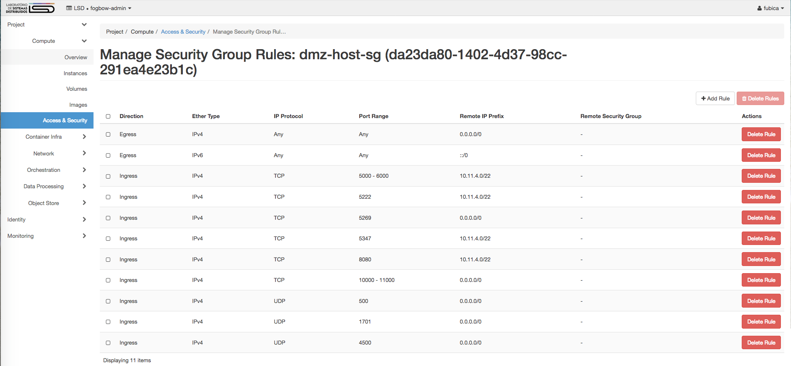

Title: Create and configure deployment machines in an Openstack cloud
url: deploy-machines-openstack-cloud
save_as: deploy-machines-openstack-cloud.html
section: install
index: 2

# Creation of deployment machines on an Openstack cloud

First, ask the cloud administrator to create a project, and associate your user to this project.
Let us assume that the project is called **fogbow-admin**.

The resource quota for the **fogbow-admin** project should allow the creation of at least 
two instances, one of them with a public IP, or with the ability to be assigned a floating public 
IP. It should also allow the creation of at least two Security Groups.

## Create the infrastructure

A typical deployment of a Fogbow site involves the installation of several services. The **messaging-service**
and part of the **federated-network-service** (the **Strong Swan** agent) are deployed in a VM outside the 
private network of the organization, ie. in a DMZ. Let us call this VM the **dmz-host**. The **dmz-host** must 
have a public IP.
 
All remaining services can be deployed in VM instances inside the private network. We assume that a 
single VM will be used, and call it **internal-host**. The following services will be deployed in this VM:
**resource-allocation-service**, **membership-service**, **federated-network-service**,
and the **fogbow-gui**. We assume that the **fogbow-gui**, which provides a graphical user interface to Fogbow
users, will be used only from inside the organization's private network. Users needing to use the **fogbow-gui**
from outside the organization will first need to setup a VPN, and then access the service through the VPN.

Before creating the above mentioned VM instances, it is necessary to create appropriate Security Groups that will
be assigned to them.

Log in in the cloud dashboard (Horizon) using your credentials and select the **fogbow-admin** project. 

Firstly, access the "Project/Networks/Network" menu (see Figure below).

You should see at least the **provider** network displayed. You need to take note of its CIDR (**10.11.4.0/22**
in the example shown in the Figure). You will also need the OpenStack ID of this network, which can be seen by
clicking on the network name, and then on the "Overview" tab (see Figure below; in this example the ID is
**64ee4355-4d7f-4170-80b4-5e8348af6a61**).

Then, access the "Project/Compute/Access & Security" menu, and create two new Security Groups, one for the
**dmz-host**, and another for the **internal-host**. You do that by clicking on the "+ CREATE SECURITY GROUP"
button, and using the values described below.
 
#### Security group for the **dmz-host**

* Name: **dmz-host-sg**
* Description: **Allows traffic to the world, and from the world to the XMPP server and the Strong Swan agent.**

After the security group is created, you need to add its rules. Click on the "MANAGE RULES" button, 
and then multiple times on the "+ADD RULE" button to add the following rules:

* **Custom TCP Rule, Ingress, Port, 5222, CIDR: provider CIDR (eg. 10.11.4.0/22).**
* **Custom TCP Rule, Ingress, Port, 5347, CIDR: provider CIDR (eg. 10.11.4.0/22).**
* **Custom TCP Rule, Ingress, Port, 5269, CIDR: 0.0.0.0/0.**
* **Custom TCP Rule, Ingress, Port, 500, CIDR: 0.0.0.0/0.**
* **Custom TCP Rule, Ingress, Port, 1701, CIDR: 0.0.0.0/0.**
* **Custom TCP Rule, Ingress, Port, 4500, CIDR: 0.0.0.0/0.**

After that, the **dmz-host-sg** Security Group should look like what is shown in the Figure below.

Ports 5222, 5347 and 5269 are used by the XMPP **messaging-service**, while ports 500, 1701, and 4500 are 
used by the **Strong Swan** agent that is part of the **federated-network-service**.

### Security group for the **internal-host**

* Name: **internal-host-sg**
* Description: **Allows traffic from the organization's private network to the **fogbow-gui** port.**

Again, click on the "MANAGE RULES" button, and on the "+ADD RULE" button to add the following rule:

* **Custom TCP Rule, Ingress, Port, 80, CIDR: organization's private network CIDR (eg. 10.0.0.0/8).**

### Create **dmz-host**

Now you can create the **dmz-host** VM. Go to the "Project/Compute/Instances" menu and click on the 
"LAUNCH INSTANCE" button. Follow the step-by-step procedure to select an appropriate image, and flavor.
Make sure you will include the **provider** network, and the **dmz-host-sg** Security Group. The
**dmz-host** will be created and will receive a private IP from the **provider** network. Let us
assume that this IP is **10.11.4.2**.

Then, you need to associate a floating IP to the newly created **dmz-host** VM. You can do that by
clicking on the "ASSOCIATE FLOATING IP" button that appears next to the VM in the "Project/Compute/Instances"
screen. Let us assume that the floating IP assigned is **100.30.1.1**.

### Create **internal-host**

Follow similar steps as described above to create the **internal-host** VM. Again, follow the step-by-step procedure
to select an appropriate image, and flavor. This time, make sure you will include the **provider** network, and the
**internal-host-sg** Security Group. The **internal-host** will be created an will receive a private IP from the
**provider** network. Let us assume that this IP is **10.11.4.3**.

### Enabling ssh access from the installation machine to the deployment machines

It is also necessary to enable ingress to port 22 from the *installation machine* to both the
**dmz-host** and the **internal-host**. Since this is only required during installation, the best
way is to create a new security group that can be assigned to these VM instances before installation,
and then removed, after the installation is completed.

Again, access the "Project/Compute/Access & Security" menu in the **fogbow-admin** project, and create
another Security Group. You do that by clicking on the "+ CREATE SECURITY GROUP"
button, and using the values described below.

* Name: **installation-machine-sg**
* Description: **Allows ssh access from the installation-machine to both the dmz-host and the internal-host.**

Then, click on the "MANAGE RULES" button, and on the "+ADD RULE" button to add the following rule
(considering the example values used in this guide):

* **Custom TCP Rule, Ingress, Port, 22, CIDR: 10.11.4.0/22.**

You can now assign the newly created security group to both the **dmz-host** and the **internal-host** by
clicking on the "Edit Security Groups" button associated with the instance, and then selecting to add (+) the
**installation-host-sg** security group on both of them. After installation, this security group can be
removed from these VM instances by clicking on the "Edit Security Groups" button, and the selecting remove (-).
