Title: Fogbow Dashboard
url: fogbow-dashboard
save_as: fogbow-dashboard.html
section: usage
index: 3

#Usage
==========

##**Login**

Depending on selected type of authentication, the Login Page will have diferent fields to be informed. below you can see some of these types:

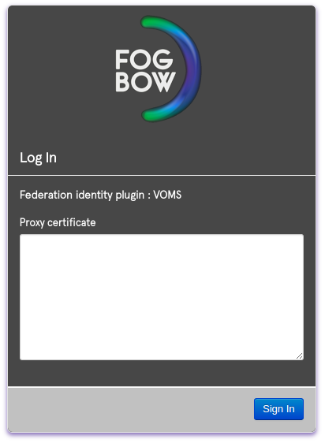

Inform your credentials acording to the authentication type and click on "Sign in" button. If your credential are valid, you will be redirected to the initial page of Fogbow Dashboard.

The first page shows a list of **Federation's Members** and some informations, like Shared CPU Quota, vCPU in use, total of used memory for each member, and other ones. The "Timestamp" column (highlighted 2) holds the time when these informations had been updated. If you want to get actual values, you should use the "Refresh" button (highlighted 1) at upper left side.

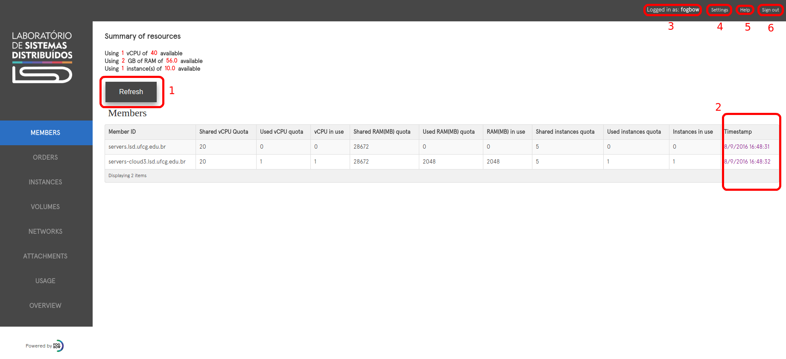

On the upper right side there are some helpfull information/functions:

3 - **Logged in as** - Shows the name of the active user in this session.

4 - **Setting** - Allows you to change the language of the Dashboard.

5 - **Help** - Shows the Fogbow Cloud Documentation section.

6 - **Sign out** - Ends actual session.

##**Order**

To request any type of resource (compute, storage or network) you need to create an order on Dashboard. To do this, select **"Orders"** on left side menu. It will open the page that you can see on the image below.

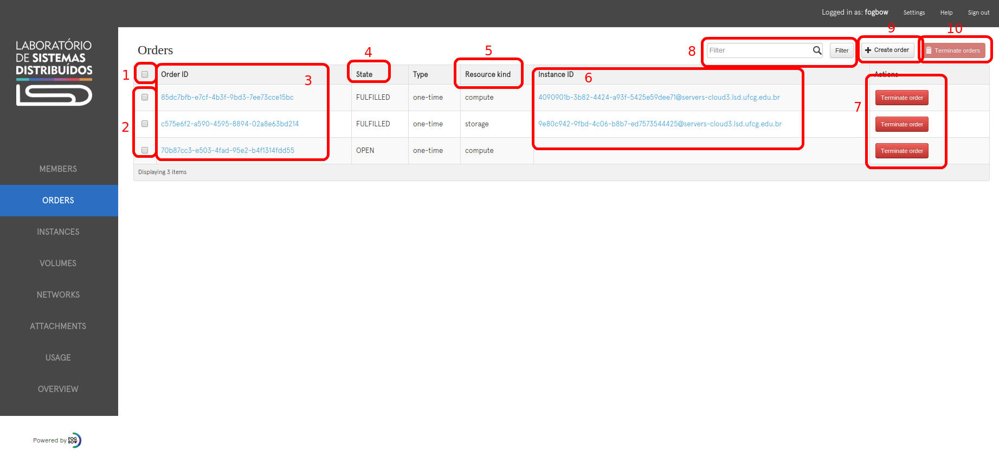

Before demonstrate how to create new orders, we will explain some informations and functionalities of this page:

1 - **Select all Orders**: Select all visible orders on page;

2 - **Select individual Order**: Select the specific Order of this line;

3 - **Order ID**: This is a link to open the order details page (see [link Order Details Page](#order-details-page));

4 - **Order state**: Indicates actual state of the order. Can have the following values: OPEN, PENDING, FULFILLED, SPAWNING, CLOSED and DELETED;

5 - **Resource Kind**: Indicates the resource's type, that can be: compute, storage and network;

6 - **Instance ID (link)**: This is a link to open the instance details page (see [link Instances](#instances));

7 - **Terminate Order button**: Terminate the order of this line.

8 - **Filter**: Filter by all columns. If any column contains the value informed on this field, the line will be displayed.

9 - **Create Order button**: Opens a modal to create a new order;

10 - **Terminate Orders button**: Terminates selected orders. Available when one or more orders are selected. Otherwise, is disabled;

###**Creating a new Order**

To create a new order, click on **Create Order** button (5). A modal will be open.

By default, compute is select as resource type, as you can see on field 2.

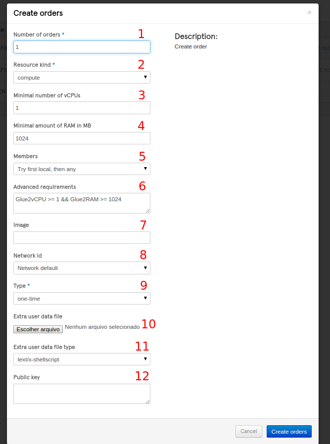

For compute resource you can choose: 

1 - **Number of Orders** (Required) - Number of compute resources to create;

3 - **Minimal number of vCPUs** - Minimal number of CPU Cores that you want for your VM(s).
If you place value 2, for example, the Fogbow manager will try to create VM(s) with 2 or more cores;

4 - **Minimal amount of RAM in MB** - Minimal amount of RAM memory for VMs. As well as minimal vCPU attribute, 
Fogbow Manager will try to create VM(s) with this amount of RAM memory or more; 

5 - **Members** - This combo box contains all members of the Federation. By default, is selected "Try first local, then any". 
It means that the Fogbow Manager will first try to create the resource(s) on local cloud. If this cloud doesn't have available resources
or the user has reached his quota limits for this cloud, then Fogbow Manager will request this resource(s) on another members;

6 - **Advanced requirements** - You can specify the vCPU size, amount of RAM memory and the Location in Glue2 format. The advantage of
this is that you can define more powerful requirements for your request. For example, you can ask VM with at least 2 cores but
no more than 4. Logical operators such AND, OR, EQUAL, NOT EQUAL, LESS THAN, GREATER THAN are accepted;

Here are some examples of Glue2 requests: 

	- Glue2vCPU > 1 && Glue2vCPU < 5 && Glue2RAM == 2048  -> Only VMs with 2 to 4 cores and exactly 2 MB of RAM.
	- Glue2RAM >= 2048  -> Any number of cores and at least 2 MB of RAM.
	- Glue2RAM >= 2048 && Glue2CloudComputeManagerID=="cloud.host.org" -> Any number of cores, at least 2 MB of RAM and only on "cloud.host.org" location.

7 - **Image** - OS Image to be deployed on VM. You can chose a existing image on cloud service or pass a image from http repository, for example http://my.repository.org/my-image.qcow2, that will be uplodate to the cloud host.

8 - **Network Id** - You can select a specific network in which the VM will be attached. This field shows only networks created by this user and with the same location selected on field 5. If no location was chose (5), then the new VM will be created on network location. VMs must have the same location of the network.

9 - **Type** (Required) - There are two options for this field: 

	* one-time: The resource will be created one time only. If further, for any reason, it fails, a new resource won't be requested and the order will be closed.
	* persistent: The resource will be created many times as need. If further, for any reason, it fails, it will be replaced by a new one.

10 - **Extra user data file type** - If you want to deploy a new instance with personal user data, like bash scripts to do initial configurations for example, you need to inform here the file type. Accepted values are: text/x-shellscript, text/x-include-once-url, text/x-include-url, text/cloud-config-archive, text/upstart-job, text/cloud-config and text/cloud-boothook.

11 - **Extra user data file** - Here you should choose the user data file to upload. Must be the same type that was chose on item 10.

12 - **Public key** - To SSH connections with the VM you need to inform your public key here.

If you want to create a Storage Resource, you must select **"storage"** at field 2. The options for Storage are:

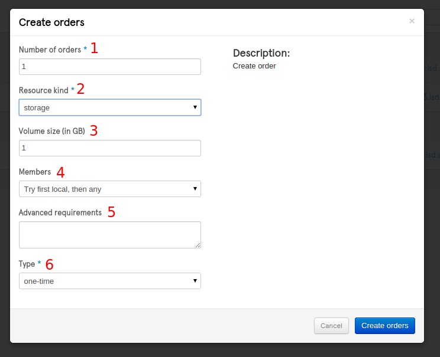

1 - **Number of Orders** (Required) - Number of storage resources to create;

3 - **Volume Size (in GB)** - Size of the storage in GigaBytes;

4 - **Members** - This combo box contains all members of the Federation. By default, is selected "Try first local, then any". 
It means that the Fogbow Manager will first try to create the resource(s) on local cloud. If this cloud doesn't have available resources
or the user has reached his quota limits for this cloud, then Fogbow Manager will request this resource(s) on another members;

5 - **Advanced requirements** - You can the Location in Glue2 format. Logical operators such EQUAL or NOT EQUAL are accepted;

	- Glue2CloudComputeManagerID=="cloud.host.org" -> Storage will be created only on "cloud.host.org" location.
	- Glue2CloudComputeManagerID!="cloud.host.org" -> Storage will be created in any place except on "cloud.host.org" location.

6 - **Type** (Required) - There are two options for this field: 

	* one-time: The resource will be created one time only. If further, for any reason, it fails, a new resource won't be requested and the order will be closed.
	* persistent: The resource will be created many times as need. If further, for any reason, it fails, it will be replaced by a new one.

If you want to create a Network Resource, you must select **"network"** at field 2. The options for Network are:

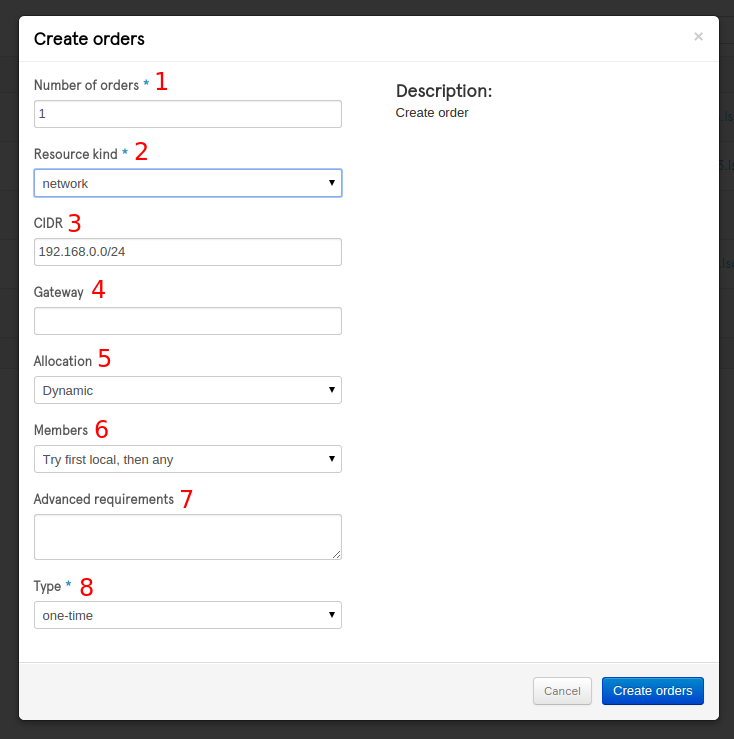

1 - **Number of Orders** (Required) - Number of network resources to create;

3 - **CDIR** (Required) - Here you should inform the network mask in CIDR format. Example: 10.20.0.0/24.

4 - **Gateway** (Required) - Here you should inform the network gateway. It must be a valid address for the network mask given by you on field 3. Example: 10.20.0.1.

5 - **Allocation** - Determines whether VMs can be dynamically allocated (after network have been created) or not. Possible values are "Dynamic" or "Static".

6 - **Members** - This combo box contains all members of the Federation. By default, is selected "Try first local, then any". 
It means that the Fogbow Manager will first try to create the resource(s) on local cloud. If this cloud doesn't have available resources
or the user has reached his quota limits for this cloud, then Fogbow Manager will request this resource(s) on another members;

7 - **Advanced requirements** - You can the Location in Glue2 format. Logical operators such EQUAL or NOT EQUAL are accepted.

	- Glue2CloudComputeManagerID=="cloud.host.org" -> Network will be created only on "cloud.host.org" location.
	- Glue2CloudComputeManagerID!="cloud.host.org" -> Network will be created in any place except on "cloud.host.org" location.

8 - **Type** (Required) - There are two options for this field: 

	* one-time: The resource will be created one time only. If further, for any reason, it fails, a new resource won't be requested and the order will be closed.
	* persistent: The resource will be created many times as need. If further, for any reason, it fails, it will be replaced by a new one.

###**Order Details Page**

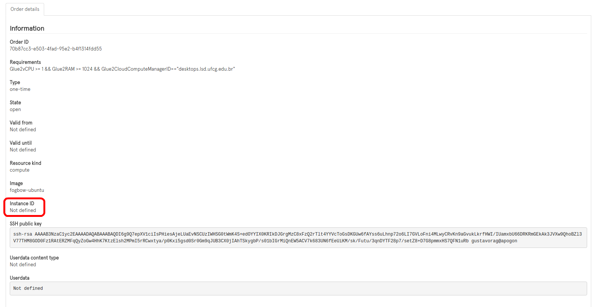

All values that you chose on creation modal will be displayed here. Which fields are displayed depends on the type of resource ordered. The highlighted area will contain the resource's id, if it was already created. This image shows a order that do not have a resource ID yet. 

======

##**Instances**

At this section you can see all instances related to your user and take some actions on these ones.

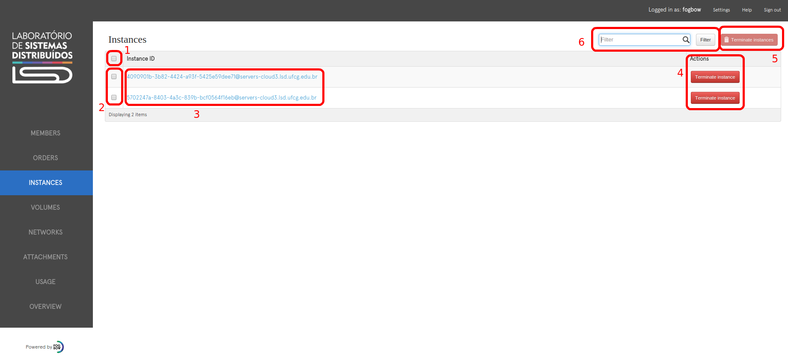

1 - **Select All** - Select all visible instances on page;

2 - **Select specific instance** - Select the specific instance on this line;

3 - **Instance ID (Link)** - This is a link to open instance details page (see image below);

4 - **Terminate Intance** - This button terminate the related instance;

5 - **Terminate instances** - This button terminates selected instances. Available when one or more orders are selected. Otherwise, is disabled;

6 - **Filter** - Filter by instance ID.

If you click on field 3, the instance details page will be open. This page shows the following informations:

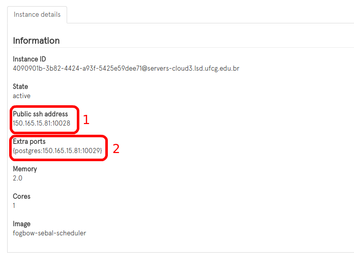

At beginning, the instance is in **inactive** state. Further, if everything go right, it will be in **active** state. It means that the instance is doing initial configurations for the cloud and soon will be prepared for SSH connections. You can see these SSH informations on field 1, **Public ssh address**. In case you have passed user data to create extra ports, these ports will be displayed on field 2, **Extra ports**.

##**Volumes**

At this section you can see all volumes related to your user and take some actions on these ones.

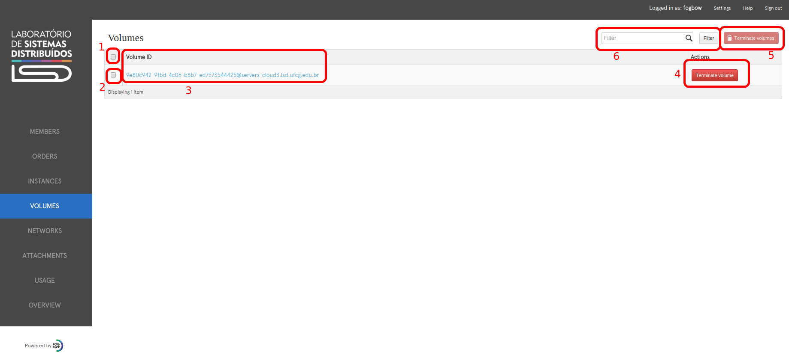

1 - **Select All** - Select all visible storage on page;

2 - **Select specific volume** - Select the specific storage on this line;

3 - **Volume ID (Link)** - This is a link to open storage details page (see image below);

4 - **Terminate volume** - This button terminate the related volume;

5 - **Terminate volumes** - This button terminates selected volumes. Available when one or more orders are selected. Otherwise, is disabled;

6 - **Filter** - Filter by volume ID.

If you click on field 3, the volume details page will be open. This page shows the following informations:

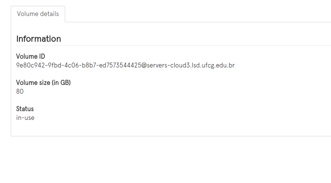

##**Networks**

At this section you can see all network related to your user and take some actions on these ones.

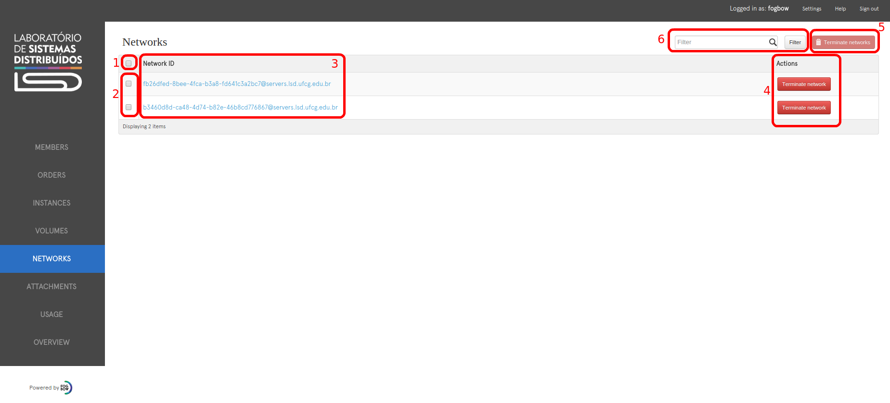

1 - **Select All** - Select all visible network on page;

2 - **Select specific network** - Select the specific network on this line;

3 - **Volume ID (Link)** - This is a link to open network details page (see image below);

4 - **Terminate network** - This button terminate the related network;

5 - **Terminate networks** - This button terminates selected networks. Available when one or more orders are selected. Otherwise, is disabled;

6 - **Filter** - Filter by network ID.

If you click on field 3, the network details page will be open. This page shows the following informations:

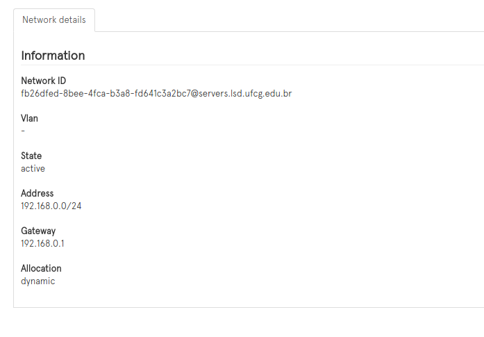

##**Attachments**

At this section you can see all attachments related to your user, take some actions on these and creat new ones. Attachments are links between **Instances** and **Storages**. Only through an attachment an Instance can directly access a storage to perform reading and writing actions. 

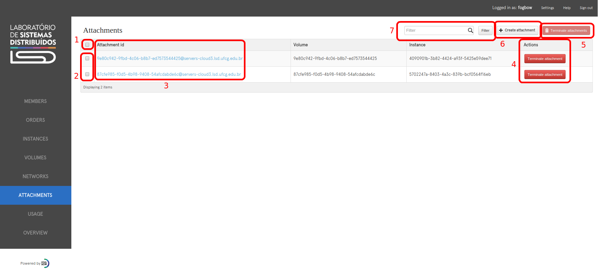

1 - **Select All** - Select all visible attachment on page;

2 - **Select specific attachment** - Select the specific attachment on this line;

3 - **Attachment ID (Link)** - This is a link to open attachment details page (see image below);

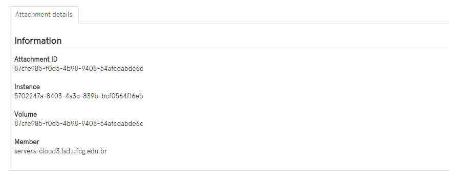

4 - **Terminate attachment** - This button terminate the related attachment;

5 - **Terminate attachments** - This button terminates selected attachment. Available when one or more orders are selected. Otherwise, is disabled;

Obs. When you delete an attachment, only the link between the instance and storage will be deleted. These two resource will remain on cloud.

6 - **Create attachment** - 

7 - **Filter** - Filter by attachment ID.

To create a new attachment between an instance and a storage, click on button "**Create attachment**" (6). 
A modal page will be open, like the image below:

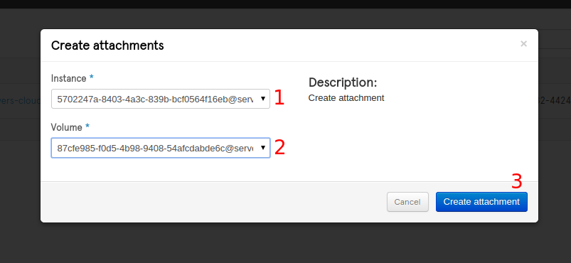

The instance (field 1) and storage (field 2) must be at the same location, therefore, when you select a value for one field, the other will be filtered by the location of the chosen value. After choose the desired resources, click on "**Create attachment**" button (3).

##**Usage**

At Usage page you can monitor the amount of **Compute** and **Storage** that each member are using. The highlighted 2 shows when these informations were updated. If you want to get more recent data, click on "**Refresh**" button.

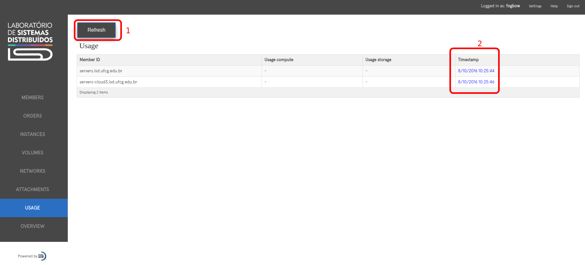

##**Overview**

The Overview page shows, as graphics, all orders of this Fogabow Manager, separeted by states.

- Fulfilled - Orders whose resources were created and delivered;

- Spawning - Orders that are looking for a remote member who can handle this requisition;

- Open - Orders that have not been handled yet;

- Pending - Orders that are been handled by remote member but are not ready yet;

- Closed - Orders whose resources failed or were deleted;

- Deleted - Orders that are been deleted from the Fogbow Manager.

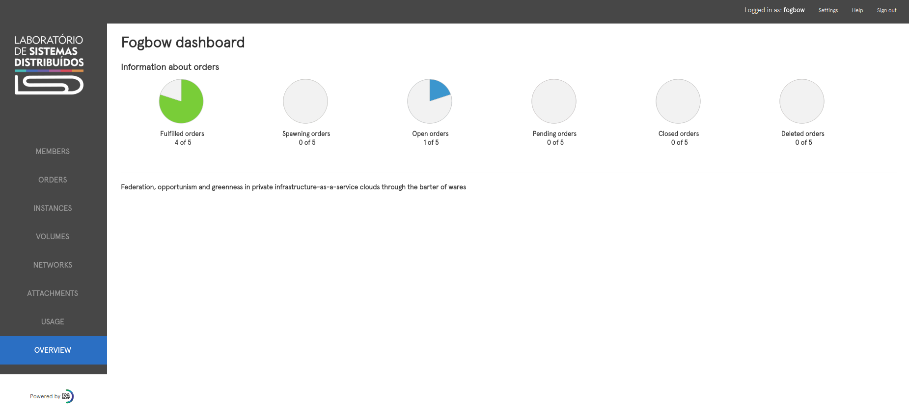
