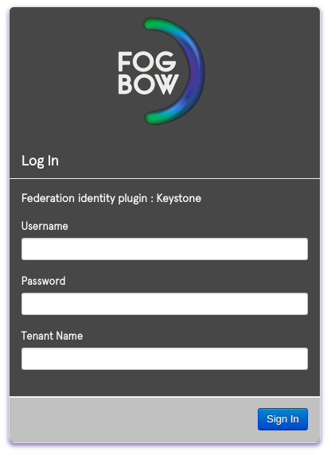
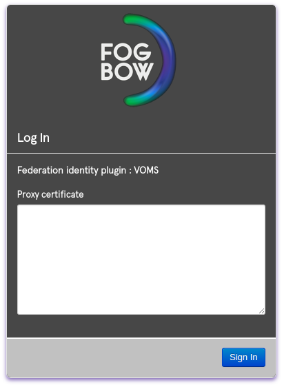
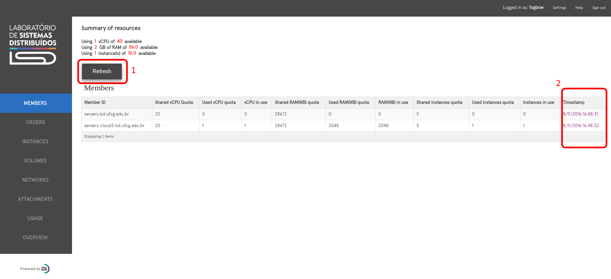

Title: Fogbow Dashboard
url: fogbow-dashboard
save_as: fogbow-dashboard.html
section: usage
index: 3

##Usage
==========

**Login**

Depends on selected type of authentication (value of FOGBOW_FEDERATION_AUTH_TYPE), the Login Page will have diferent fields to be informed. Above you can see some of these types:

Inform your credentials acording to the authentication type and click on "Sing in" button. If your credential are valid, you will be redirect to the initial page of Fogbow Dashboard.

This page shows a list of **Federation's Members** and some informations, like Shared CPU Quota, vCPU in use, total of used memory for each member, and other ones. The "Timestamp" column (highlighted 2) holds the time when these informations had been updated. If you want to get actual values for the table you should use the "Refresh" button (highlighted 1) at upper left side.

On the upper right side there are some helpfull information/functions:

3 - **Logged in as** - Shows the name of the active user in this session.

4 - **Setting** - Allows you to change the language of the Dashboard.

5 - **Help** - Shows the Fogbow Cloud Documentation section.

6 - **Sign out** - Ends actual session.
