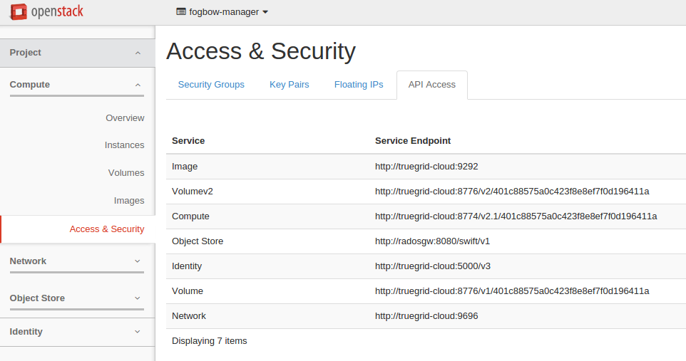
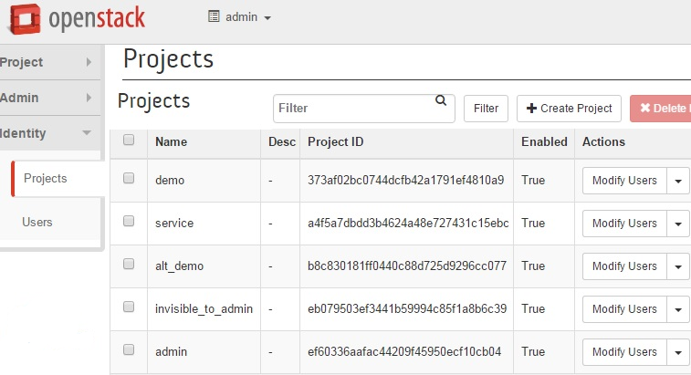
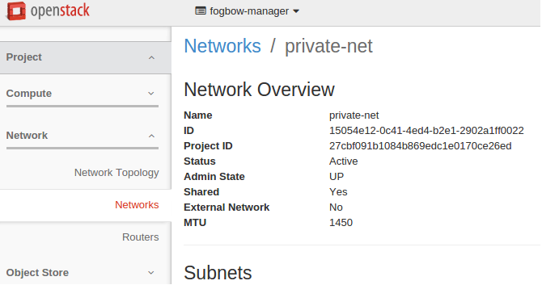
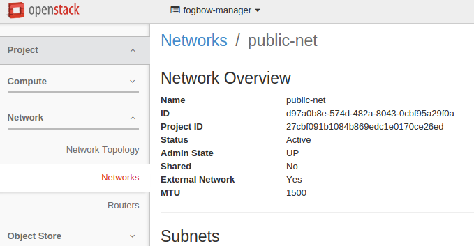
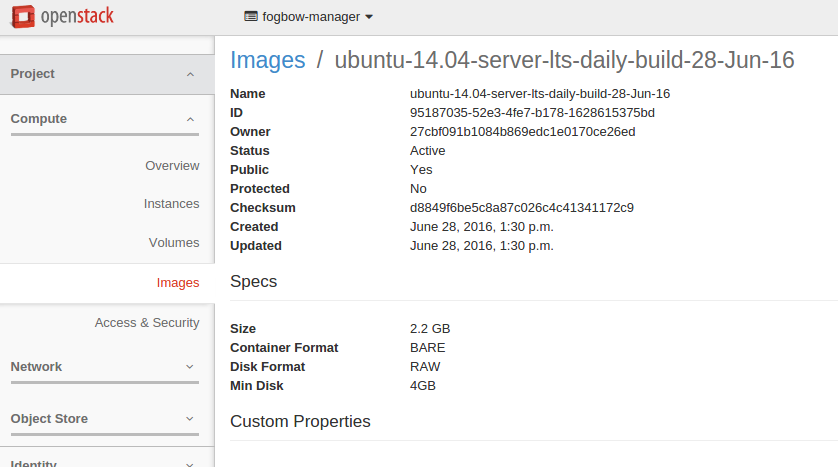

Title: Openstack deployment information
url: openstack-deployment-information
save_as: openstack-deployment-information.html
index: 0

Openstack deployment information
=====

Below we show where to find in the OpenStack dashboard the information to configure the Fogbow Manager (through the **infrastructure.conf** and the **federation.conf** files).

infrastructure.conf properties
------

The image below (starting from the right menu, then following the links: compute, access & secure and compute) shows the URls of OpenStack APIs. Based on this information, we can configure these properties:

```
(based on the compute field)
compute_novav2_url=http://truegrid-cloud:8774

(based on the image field)
compute_glancev2_url=http://truegrid-cloud:9292

(based on the storage field)
storage_v2_url=http://truegrid-cloud:8776

(based on the network field)
network_openstack_v2_url=http://truegrid-cloud:9696

(based on the identify field)
# when the local_identity_class or the federation_identity_class is using KeystoneV3IdentityPlugin.
local_identity_url=http://truegrid-cloud:5000
```



```
```

* No dashboard Openstack * Identity (Right Menu) >> Users (Right Menu)  >> Choose the user (Main Content)


```
No dashboard Openstack * Identity (Right Menu) >> Users (Right Menu)  >> Choose your user (Main Content)
mapper_defaults_userId=$user_id
User password
mapper_defaults_password=$user_pass
No dashboard Openstack * Identity (Right Menu) >> Projects (Right Menu)  >> Choose your project (Main Content)
mapper_defaults_projectId=$project_id

If local_identity_class or  federation_identity_class is using KeystoneIdentityPlugin. For more information in the Mapper section: http://www.fogbowcloud.org/interoperability-behavioral-plugins
Username
mapper_defaults_username=$username
User password
mapper_defaults_password=$user_pass
Tenant Name
mapper_defaults_tenantName=$tenant_name
```

From the networking section of the OpenStack dashboard (starting from the right menu, then following the links: network, networks), as shown in the images below, it is possible to configure the following properties:

```
Example:
compute_novav2_network_id=15054e12-0c41-4ed4-b2e1-2902a1ff0022
external_gateway_info=d97a0b8e-574d-482a-8043-0cbf95a29f0a
```






From the images section of the OpenStack dashboard (starting from the right menu, then following the links: compute, images), as shown in the images below, it is possible to configure the id of an image to be used by virtual machines created by the fogbow, as indicated by the following property:

```
image_storage_static_fogbow-ubuntu=95187035-52e3-4fe7-b178-1628615375bd
```



For the federation.conf.
------
* No dashboard Openstack * Compute (Right Menu) >> Access & Secure (Right Menu)  >> Identity (Main Content).


```
Example:
federation_identity_url=http://truegrid-cloud:5000
```
