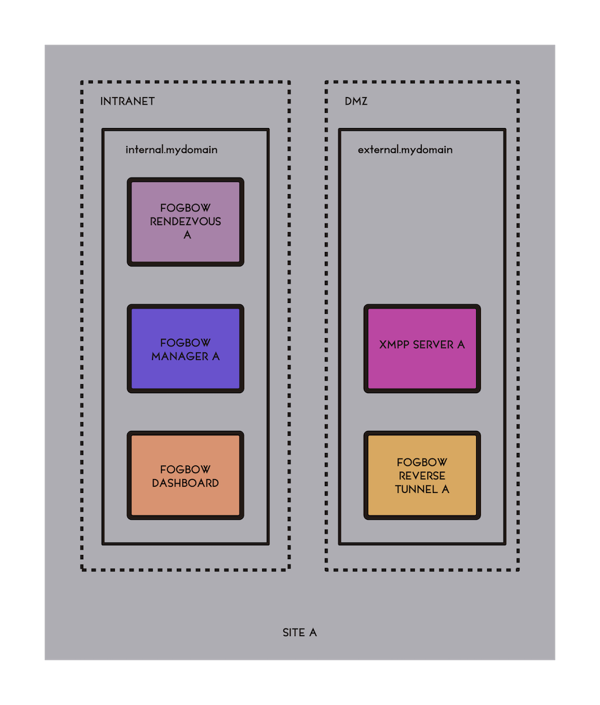

Title: The Big Picture
url: the-big-picture
save_as: the-big-picture.html
section: install
index: 0

The Big Picture
==========

Architectural Overview
------

The architecture of the Fogbow middleware is based on two main components: the **Fogbow Rendezvous** (FR) and the **Fogbow Manager** (FM). The FR is a membership service contacted by a FM to discover the other active FMs in a federation. The FM allocates resources in any cloud that belong to the federation. At the local site, the FM allocates resources by interaction with the cloud orchestrator running atop the local IaaS cloud. Resources are allocated in remote sites with the help of the FM running at each particular site, which interacts with the remote cloud orchestrator. An FM that receives a request that needs to be fulfilled at a remote site interacts with the appropriate FM to get the request served. To conceal the details of the various IaaS services in a federation, the FM relies on well-defined interoperability plugins. There are also behavioural plugins that can be used to customize key parts of the FM business logic, such as authentication, authorization, request prioritization, selection of remote members for request outsourcing, and so on. The communication among FRs and FMs is mediated by an internet friendly messaging service based on <a href="https://en.wikipedia.org/wiki/XMPP" target="_blank">XMPP</a>. If the local cloud is not able to provide each VM with its public IP - which is often the case in private clouds - Fogbow provides a **Reverse Tunnel service** (FRT). This service provides public IP access from the domain's <a href="https://en.wikipedia.org/wiki/DMZ_(computing)" target="_blank">DMZ</a> to all virtual machines created in the domain's  intranet. In addition, the FRT can also be used on demand to create other tunnels to the VMs. For example, a VM instance that needs to provide a service through a web-based interface will have to create a tunnel for the HTTP protocol, so that the users of this service are able to access them from the web. The figure below shows the architecture just described.

Deployment Overview
------
A typical deployment of Fogbow will require two dedicated machines (either real or virtual). Let us call them **internal.mydomain** and **external.mydomain**. The **internal.mydomain** machine is part of the organization's private network and must have access to the endpoints of the cloud that is being federated. On the other hand, the **external.mydomain** machine should be outside the organization's private network, within a DMZ. The FR and FM components are deployed in the **internal.mydomain** machine, while the XMPP server and the FRT component are deployed in the **external.mydomain** machine. The figure below shows this arrangement.

